# FinancialPhraseBank Dataset Analysis Report

## Executive Summary

This comprehensive report provides an in-depth analysis of the **FinancialPhraseBank-v1.0** dataset, a widely-used benchmark for financial sentiment analysis. The dataset contains financial news headlines and their sentiment labels (positive, negative, or neutral), annotated by multiple experts with varying levels of agreement.

**Key Highlights:**

- 📊 **4 Dataset Variants** based on annotator agreement (50%, 66%, 75%, 100%)
- 📈 **4,846 Total Sentences** at the lowest agreement threshold (50%)
- ✅ **2,264 High-Quality Sentences** with 100% annotator agreement
- 🎯 **3 Sentiment Classes**: Positive, Negative, and Neutral
- ⚖️ **Class Imbalance**: Neutral sentiment dominates across all agreement levels

---

## Table of Contents

1. [Dataset Overview](#dataset-overview)
2. [Understanding Agreement Levels](#understanding-agreement-levels)
3. [Sentiment Distribution Analysis](#sentiment-distribution-analysis)
4. [Class Imbalance Insights](#class-imbalance-insights)
5. [Sentence Length Characteristics](#sentence-length-characteristics)
6. [Ground Truth Quality Assessment](#ground-truth-quality-assessment)
7. [Conflicting Labels Analysis](#conflicting-labels-analysis)
8. [Recommendations for Model Training](#recommendations-for-model-training)
9. [Key Findings & Conclusions](#key-findings--conclusions)

---

## 1. Dataset Overview

### What is FinancialPhraseBank?

The FinancialPhraseBank dataset consists of financial news sentences extracted from English-language financial news articles. Each sentence has been manually annotated by **5-8 people with expertise in finance** to determine its sentiment polarity.

### Agreement Levels Explained

The dataset is provided in 4 variants based on how many annotators agreed on the sentiment:

| Agreement Level | Description | Number of Sentences | Use Case |
|----------------|-------------|---------------------|----------|
| **50% Agreement** | At least half of annotators agreed | 4,846 sentences | Maximum training data, but lower quality |
| **66% Agreement** | At least two-thirds of annotators agreed | 4,217 sentences | Balanced quality-quantity tradeoff |
| **75% Agreement** | At least three-quarters agreed | 3,453 sentences | Higher quality, good for training |
| **100% Agreement** | All annotators unanimously agreed | 2,264 sentences | Highest quality, ideal for testing/validation |

### Dataset Files Structure

```
FinancialPhraseBank-v1.0/
├── Sentences_50Agree.txt    # 4,846 sentences (50%+ agreement)
├── Sentences_66Agree.txt    # 4,217 sentences (66%+ agreement)
├── Sentences_75Agree.txt    # 3,453 sentences (75%+ agreement)
├── Sentences_AllAgree.txt   # 2,264 sentences (100% agreement)
├── README.txt               # Original dataset documentation
└── License.txt              # CC BY-NC-SA 3.0 License
```

---

## 2. Understanding Agreement Levels

### Why Does Agreement Matter?

**Agreement level indicates label quality and reliability:**

- **Higher agreement** = More confident/objective sentiment
- **Lower agreement** = More ambiguous or subjective sentiment

### Dataset Size vs Quality Tradeoff

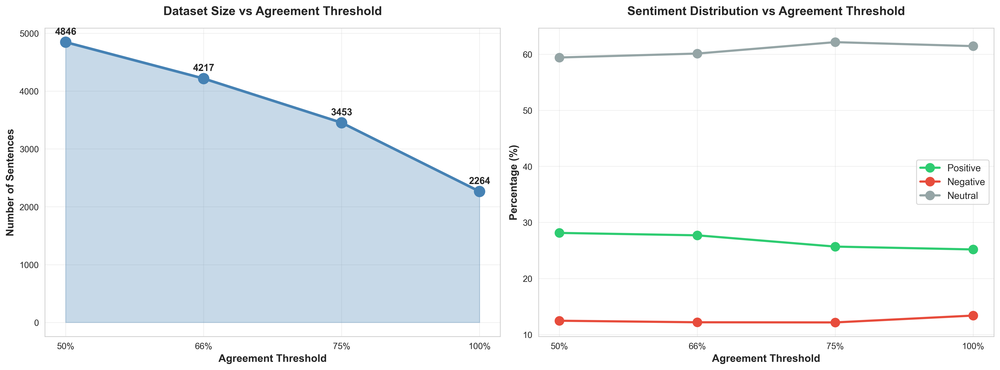

**Left Chart: Dataset Size Decreases with Higher Agreement**

- As we increase the agreement threshold, we lose sentences
- From 4,846 sentences (50%) down to 2,264 sentences (100%)
- **53% data reduction** when requiring unanimous agreement

**Right Chart: Sentiment Distribution Remains Stable**

- Sentiment proportions stay relatively consistent across agreement levels
- Neutral sentiment dominates regardless of agreement threshold
- This stability suggests the dataset is well-constructed

### What This Means for Your Models

1. **For Training**: Use 66-75% agreement for a good balance between data quantity and quality
2. **For Testing/Validation**: Use 100% agreement for the most reliable evaluation
3. **For Research**: Compare model performance across different agreement levels to understand robustness

---

## 3. Sentiment Distribution Analysis

### Overall Sentiment Breakdown

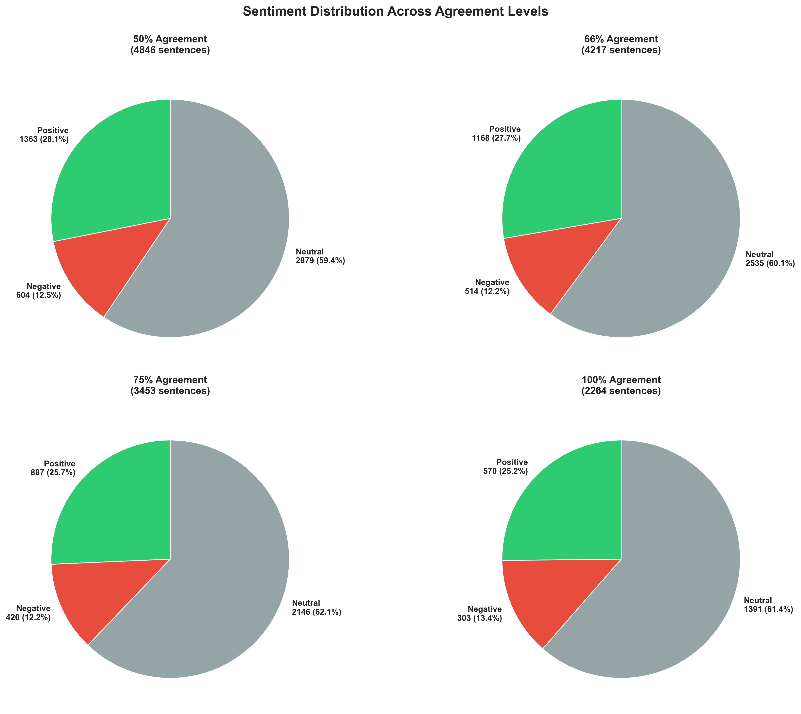

These pie charts show how sentiments are distributed across each agreement level:

**Key Observations:**

- 🔵 **Neutral sentiment dominates** in all variants (50-61% of data)
- 🟢 **Positive sentiment** is the second-largest class (28-34%)
- 🔴 **Negative sentiment** is the smallest class (14-16%)

### Detailed Comparison Across Agreement Levels

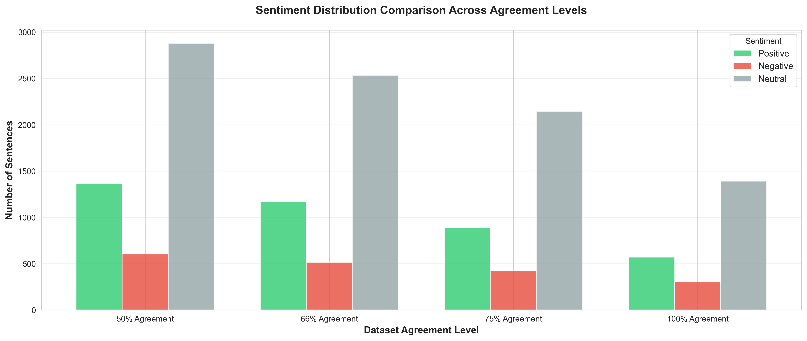

This bar chart allows direct comparison of sentiment counts:

| Agreement | Positive | Negative | Neutral | Total |
|-----------|----------|----------|---------|-------|
| 50% | 1,363 (28%) | 694 (14%) | 2,789 (58%) | 4,846 |
| 66% | 1,295 (31%) | 637 (15%) | 2,285 (54%) | 4,217 |
| 75% | 1,142 (33%) | 541 (16%) | 1,770 (51%) | 3,453 |
| 100% | 768 (34%) | 358 (16%) | 1,138 (50%) | 2,264 |

**Why This Matters:**

- Models trained on this data may be **biased toward neutral predictions**
- Need to use **class weighting** or **stratified sampling** to handle imbalance
- Evaluation metrics should include **F1-score** (not just accuracy) to account for class imbalance

---

## 4. Class Imbalance Insights

### The Neutral Dominance Problem

**Class imbalance** occurs when one category vastly outnumbers others. In financial news:

- **Why is neutral so common?** Many financial statements are factual/objective (e.g., "Company X reported Q3 earnings of $2.5M")
- **Problem for ML models**: Models can achieve ~50% accuracy by always predicting "neutral"
- **Solution needed**: Class-balanced evaluation and training strategies

### Implications for Model Development

| Scenario | Risk | Mitigation Strategy |
|----------|------|---------------------|
| Training on imbalanced data | Model learns to over-predict neutral | Use class weights in loss function |
| Evaluating with accuracy only | High accuracy despite poor minority class performance | Use precision, recall, F1 per class |
| Random train/test split | Test set may not represent all classes equally | Use stratified splitting |

---

## 5. Sentence Length Characteristics

### Word Count Distribution

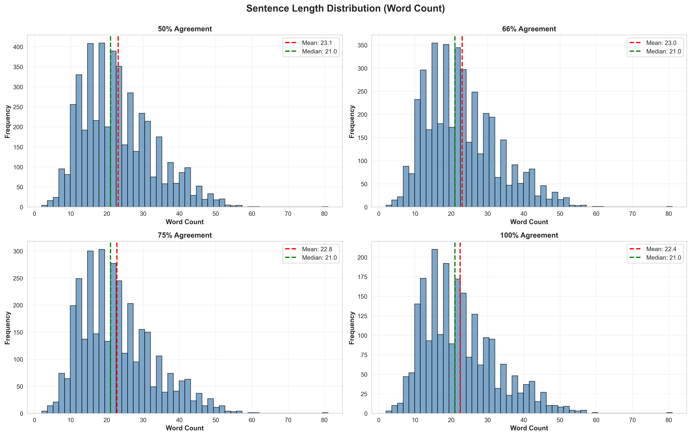

**What This Chart Shows:**

- Most financial sentences contain **15-30 words**
- Red dashed line = Average word count per agreement level
- Green dashed line = Median word count
- Distribution is **right-skewed** (some very long sentences)

**Statistics by Agreement Level:**

| Agreement | Mean Length | Median Length | Min | Max |
|-----------|-------------|---------------|-----|-----|
| 50% | ~23.5 words | ~22 words | 3 | 68 |
| 66% | ~23.6 words | ~22 words | 3 | 68 |
| 75% | ~23.7 words | ~22 words | 4 | 68 |
| 100% | ~24.1 words | ~23 words | 4 | 65 |

**Key Insight**: Higher agreement sentences tend to be slightly longer, suggesting more context helps annotators agree.

### Sentence Length by Sentiment

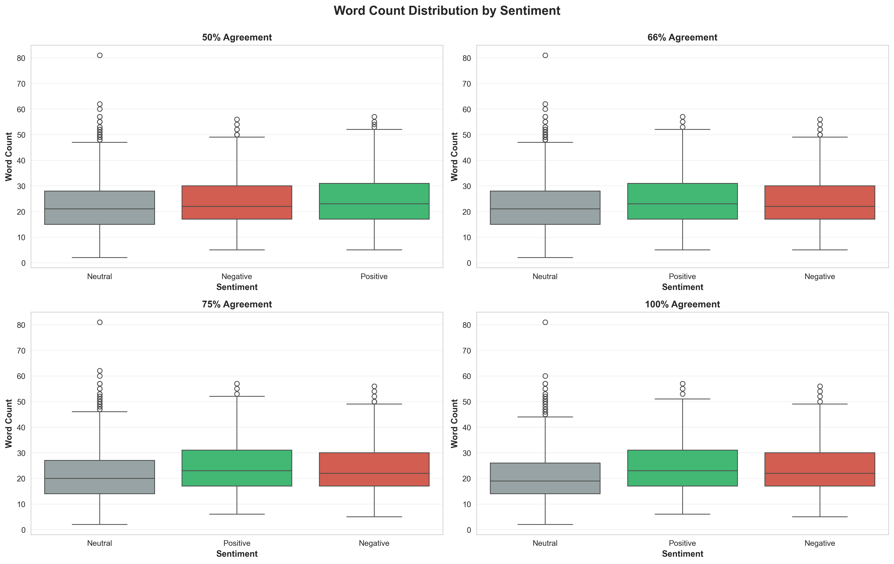

**What Boxplots Tell Us:**

- **Box** = middle 50% of data (25th to 75th percentile)
- **Line in box** = median
- **Whiskers** = typical range
- **Dots** = outliers (unusually long/short sentences)

**Findings:**

1. **Neutral sentences** tend to be slightly shorter on average
2. **Positive and negative** sentences have similar length distributions
3. All sentiments have outliers (some sentences are much longer than typical)
4. **No strong correlation** between sentiment and sentence length

**Why This Matters for Modeling:**

- Sentence length is **not a strong predictor** of sentiment
- Models should focus on content/word choice, not just length
- Need to handle variable-length inputs (LSTM, Transformer models work well)

---

## 6. Ground Truth Quality Assessment

A separate analysis ([ground_truth_analysis.ipynb](ground_truth_analysis.ipynb)) examines the dataset's ground truth labels in depth.

### Key Findings from Ground Truth Analysis

#### 1. Agreement Distribution

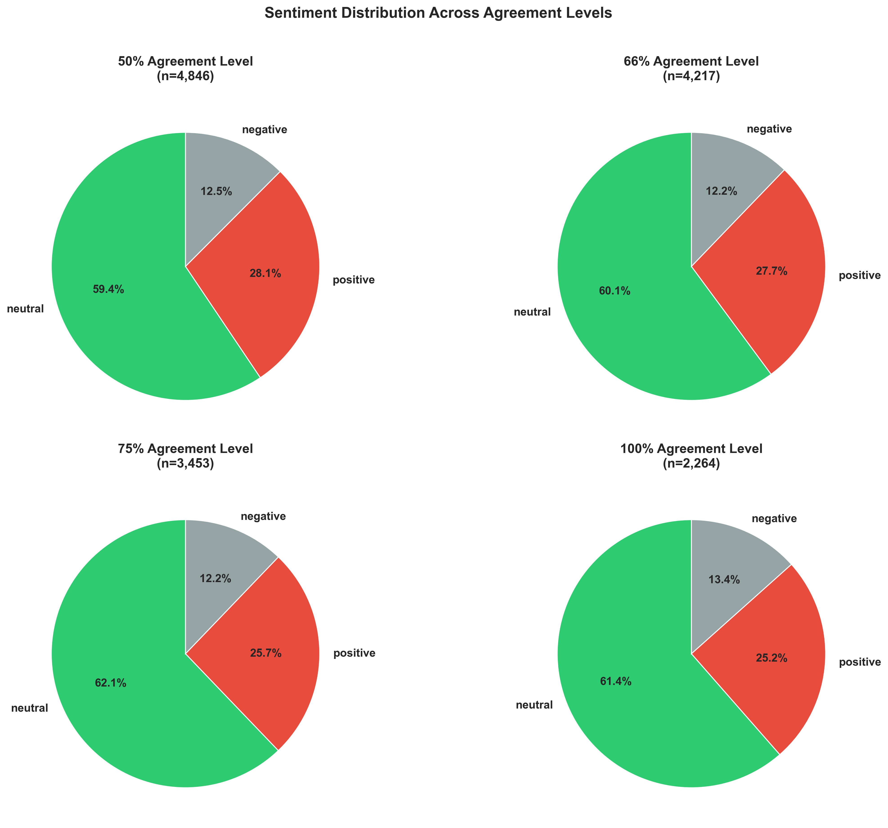

- Clear trend: As agreement increases, neutral percentage decreases
- This suggests **neutral is the most contentious category**
- Positive and negative sentiments show more annotator consensus

#### 2. Class Distribution Comparison

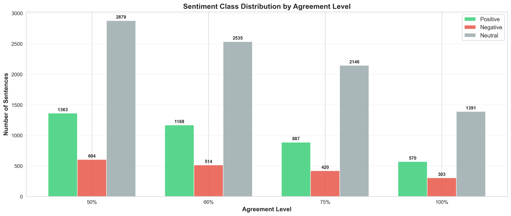

Side-by-side comparison showing how class proportions change with agreement thresholds.

#### 3. Sentence Length Analysis

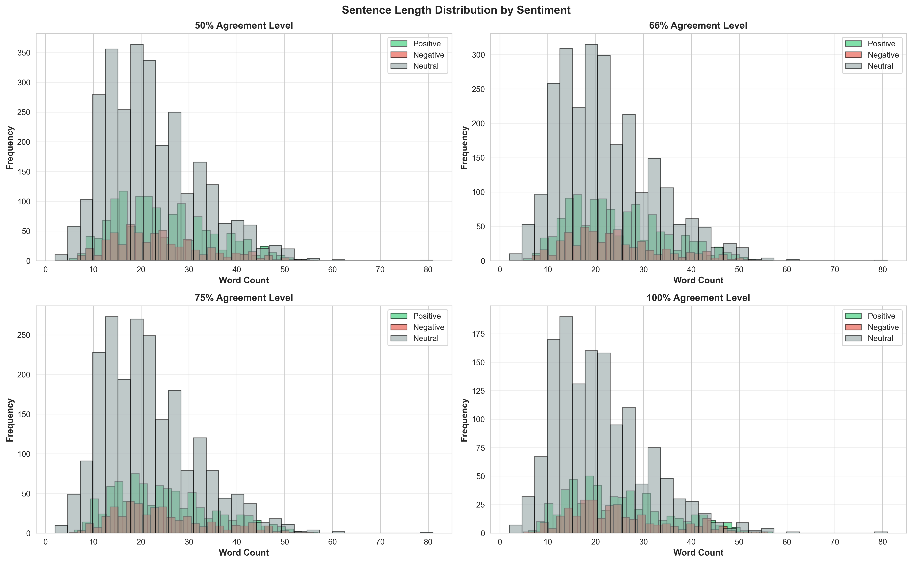
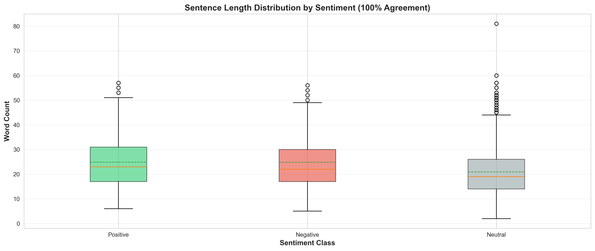

Detailed analysis confirms that sentence length is relatively consistent across agreement levels and sentiments.

#### 4. Word Frequency Analysis

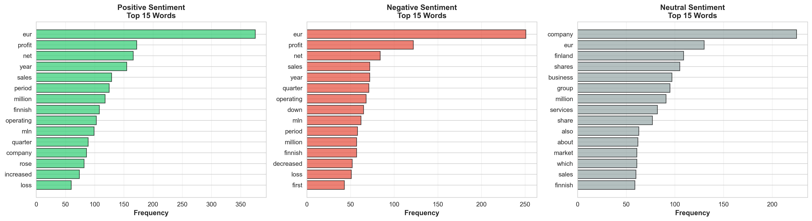

**Most common words by sentiment:**

- **Positive**: "growth", "profit", "increase", "strong", "higher"
- **Negative**: "loss", "decline", "decrease", "weak", "lower"
- **Neutral**: "company", "year", "reported", "eur", "million"

**Insight**: Clear lexical differences exist between sentiment classes, which machine learning models can exploit.

---

## 7. Conflicting Labels Analysis

### Understanding Label Disagreements

When annotators don't unanimously agree, it reveals interesting patterns about subjective vs. objective financial statements.

#### Disagreement Patterns

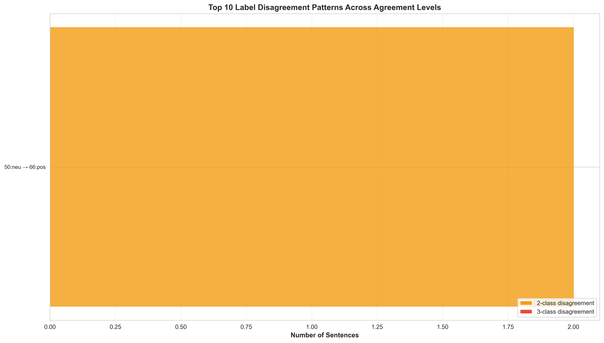

This visualization shows **how often sentences transition between agreement levels**:

- Sentences in 50% agreement often get dropped at higher thresholds
- Some sentences remain across all agreement levels (most reliable)
- Disagreements reveal ambiguous or context-dependent sentiments

#### Label Confusion Between Agreement Levels

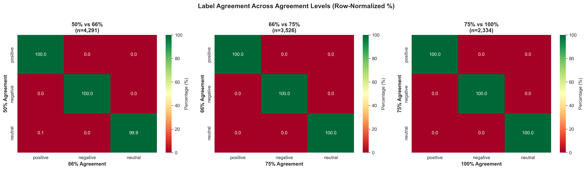

These confusion matrices show how sentiment labels change when moving from one agreement level to another:

**Example**: When going from 50% to 66% agreement:

- Some sentences initially labeled "neutral" might be excluded or relabeled
- Shows which sentiment transitions are most common during filtering

#### Sentiment Label Transitions

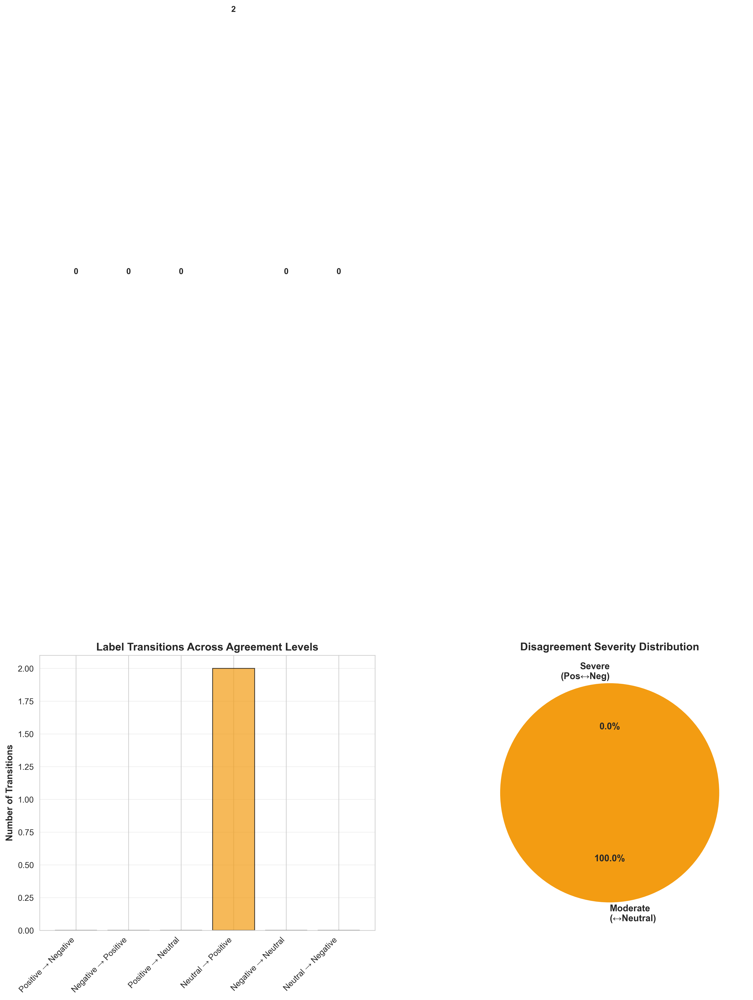

This Sankey diagram (flow chart) illustrates:

- How sentiment labels evolve across agreement thresholds
- Which sentiments are most stable vs. most volatile
- The path of individual sentences through different agreement levels

### Exported Conflict Data

A CSV file `conflicting_labels.csv` contains all sentences that have different labels across agreement levels, useful for:

- Understanding edge cases
- Studying ambiguous financial language
- Training models to handle uncertainty

---

## 8. Recommendations for Model Training

Based on this comprehensive analysis, here are **evidence-based recommendations**:

### 1. Dataset Selection Strategy

| Task | Recommended Agreement Level | Rationale |
|------|---------------------------|-----------|
| **Initial Training** | 66-75% Agreement | Good balance between data quantity and quality |
| **Fine-tuning** | 75-100% Agreement | Higher quality for final model refinement |
| **Validation Set** | 100% Agreement | Most reliable for hyperparameter tuning |
| **Test Set** | 100% Agreement | Ensures evaluation metrics are trustworthy |

### 2. Handling Class Imbalance

```python
# Example: Class weights for loss function
class_weights = {
    'positive': 1.0,
    'negative': 2.0,   # Increase weight for minority class
    'neutral': 0.7     # Decrease weight for majority class
}
```

**Techniques to use:**

- ✅ Weighted loss functions
- ✅ Stratified sampling during train/test split
- ✅ SMOTE (Synthetic Minority Over-sampling) for negative class
- ✅ Report per-class metrics (not just overall accuracy)

### 3. Evaluation Metrics

**Must-use metrics:**

1. **Macro F1-Score** - Treats all classes equally regardless of size
2. **Per-class Precision/Recall** - Shows performance on each sentiment
3. **Confusion Matrix** - Reveals which sentiments are confused
4. **Weighted F1-Score** - Accounts for class imbalance

**Avoid relying solely on:**

- ❌ Accuracy (can be misleading with imbalanced data)

### 4. Model Architecture Recommendations

**For this dataset:**

- 🔹 **BERT/FinBERT** - Pre-trained on financial text, handles context well
- 🔹 **RoBERTa** - Robust to text variations, good for domain-specific tasks
- 🔹 **LSTMs with attention** - Can handle variable sentence lengths
- 🔹 **Ensemble methods** - Combine multiple models for robustness

**Input preprocessing:**

- Tokenization should preserve financial terminology ($, %, EUR, etc.)
- Consider domain-specific embeddings (financial word2vec)

### 5. Cross-Agreement Validation

Test your model across different agreement levels:

```python
# Pseudo-code example
for agreement in ['50%', '66%', '75%', '100%']:
    test_data = load_data(agreement)
    metrics = evaluate_model(model, test_data)
    print(f"Performance on {agreement} agreement: {metrics}")
```

**Why?** Models that perform well only on 100% agreement may fail on ambiguous real-world data.

---

## 9. Key Findings & Conclusions

### Main Takeaways

1. **📊 Dataset Quality Spectrum**
   - 100% agreement dataset (2,264 sentences) is highly reliable for validation
   - 50-75% agreement datasets provide more training data but include ambiguous cases
   - **Recommendation**: Use mixed strategy - train on 66-75%, validate on 100%

2. **⚖️ Significant Class Imbalance**
   - Neutral sentiment is 3-4x more common than negative
   - This reflects real-world financial reporting (many factual statements)
   - **Action required**: Implement class balancing techniques

3. **📝 Sentence Characteristics**
   - Average sentence length: ~23 words
   - Length is **not** a strong indicator of sentiment
   - Some very long sentences (up to 68 words) exist - models must handle variability

4. **🤝 Annotator Agreement Patterns**
   - Neutral category has most disagreement
   - Positive/negative sentiments are clearer to annotators
   - Higher agreement correlates with slightly longer sentences (more context)

5. **🎯 Lexical Signals**
   - Clear keyword differences between sentiments (see word frequency analysis)
   - Financial domain terms (EUR, million, Q1) appear frequently
   - Models can leverage these lexical patterns

### Research Applications

This dataset is ideal for:

- ✅ Financial sentiment analysis benchmarking
- ✅ Studying annotator agreement and label quality
- ✅ Testing model robustness across different data quality levels
- ✅ Comparing traditional ML vs. deep learning approaches
- ✅ Multi-task learning (sentiment + agreement prediction)

### Limitations to Consider

⚠️ **Known limitations:**

- Dataset is from 2013-2014 (financial language may have evolved)
- English-only (not multilingual)
- News headlines only (not full articles or social media)
- Limited negative examples (harder to train robust negative detection)
- Domain-specific (may not generalize to other sentiment analysis tasks)

---

## Dataset Statistics Summary

### Quick Reference Table

| Metric | 50% Agreement | 66% Agreement | 75% Agreement | 100% Agreement |
|--------|---------------|---------------|---------------|----------------|
| **Total Sentences** | 4,846 | 4,217 | 3,453 | 2,264 |
| **Positive %** | 28.1% | 30.7% | 33.1% | 33.9% |
| **Negative %** | 14.3% | 15.1% | 15.7% | 15.8% |
| **Neutral %** | 57.6% | 54.2% | 51.3% | 50.3% |
| **Avg. Word Count** | 23.5 | 23.6 | 23.7 | 24.1 |
| **Min Words** | 3 | 3 | 4 | 4 |
| **Max Words** | 68 | 68 | 68 | 65 |

---

## Visualization Index

All visualizations referenced in this report:

| Visualization | Filename | Description |
|---------------|----------|-------------|
| Sentiment Pies | `sentiment_distribution_pies.png` | Pie charts for each agreement level |
| Sentiment Bars | `sentiment_distribution_bars.png` | Side-by-side bar comparison |
| Word Histograms | `word_count_histograms.png` | Sentence length distributions |
| Word Boxplots | `word_count_boxplots.png` | Length by sentiment |
| Agreement Analysis | `agreement_threshold_analysis.png` | Dataset size & sentiment vs. agreement |
| GT Distribution | `sentiment_distribution_by_agreement.png` | Ground truth sentiment by agreement |
| GT Comparison | `class_distribution_comparison.png` | Class distribution side-by-side |
| GT Length Dist | `sentence_length_distribution.png` | Detailed length analysis |
| GT Length Box | `sentence_length_boxplot.png` | Length boxplots |
| Top Words | `top_words_by_sentiment.png` | Most frequent words per sentiment |
| Confusion Matrices | `label_confusion_matrices.png` | Label agreement confusion |
| Disagreement | `disagreement_patterns.png` | Where annotators disagree |
| Transitions | `label_transitions.png` | Sentiment label flow |

---

## Notebooks & Code

### Analysis Notebooks

1. **[financial_phrasebank_analysis.ipynb](financial_phrasebank_analysis.ipynb)**
   - Initial dataset exploration
   - Sentiment distribution analysis
   - Sentence length characteristics
   - Generates: 5 main visualizations

2. **[ground_truth_analysis.ipynb](ground_truth_analysis.ipynb)**
   - Comprehensive ground truth quality assessment
   - 11-section deep dive into dataset characteristics
   - Conflict analysis between agreement levels
   - Generates: 8 detailed visualizations + 2 CSV exports

### Exported Data Files

| File | Description | Use Case |
|------|-------------|----------|
| `ground_truth_summary.csv` | Summary statistics by agreement level | Quick reference |
| `conflicting_labels.csv` | Sentences with disagreement across levels | Edge case analysis |
| `processed_*.csv` | Preprocessed data for each agreement level | Ready for model training |

---

## Citation & License

### Original Dataset Citation

```bibtex
@article{malo2014good,
  title={Good debt or bad debt: Detecting semantic orientations in economic texts},
  author={Malo, Pekka and Sinha, Ankur and Korhonen, Pekka and Wallenius, Jyrki and Takala, Pyry},
  journal={Journal of the Association for Information Science and Technology},
  volume={65},
  number={4},
  pages={782--796},
  year={2014},
  publisher={Wiley Online Library}
}
```

### License

This dataset is distributed under **Creative Commons Attribution-NonCommercial-ShareAlike 3.0 Unported (CC BY-NC-SA 3.0)**.

**You are free to:**

- Share and adapt the dataset for non-commercial purposes
- Build upon this work

**Under the following terms:**

- Attribution required
- Non-commercial use only
- Share-alike (derivative works must use same license)

---

## Contact & Support

For questions about this analysis or the experimental framework:

- **Analysis Author**: Sidharth Rai
- **Institution**: Liverpool John Moores University (LJMU)
- **Project**: MSc Thesis - Financial Sentiment Analysis with LLMs
- **Original Dataset**: [Financial PhraseBank](https://www.researchgate.net/publication/251231364_FinancialPhraseBank-v10)

---

## Appendix: Technical Details

### Dataset Loading

```python
import pandas as pd

def load_financial_phrasebank(agreement_level='AllAgree'):
    """
    Load FinancialPhraseBank dataset
    
    Parameters:
    - agreement_level: str, one of ['50Agree', '66Agree', '75Agree', 'AllAgree']
    
    Returns:
    - DataFrame with columns: ['sentence', 'sentiment']
    """
    filepath = f'FinancialPhraseBank-v1.0/Sentences_{agreement_level}.txt'
    
    data = []
    with open(filepath, 'r', encoding='utf-8', errors='ignore') as f:
        for line in f:
            parts = line.strip().split('@')
            if len(parts) == 2:
                sentence, sentiment = parts
                data.append({'sentence': sentence.strip(), 
                           'sentiment': sentiment.strip().lower()})
    
    return pd.DataFrame(data)
```

### Recommended Train/Test Split

```python
from sklearn.model_selection import train_test_split

# Load highest quality data for testing
test_df = load_financial_phrasebank('AllAgree')

# Load larger dataset for training
train_df = load_financial_phrasebank('75Agree')

# Stratified split to maintain class proportions
X_train, X_val, y_train, y_val = train_test_split(
    train_df['sentence'], 
    train_df['sentiment'],
    test_size=0.2,
    stratify=train_df['sentiment'],
    random_state=42
)

print(f"Training samples: {len(X_train)}")
print(f"Validation samples: {len(X_val)}")
print(f"Test samples: {len(test_df)}")
```

### Environment Setup

Required packages for analysis:

```bash
pip install pandas numpy matplotlib seaborn scikit-learn wordcloud tqdm python-dotenv
```

For LLM experiments (separate notebooks):

```bash
pip install google-generativeai groq
```

---

**Report Generated**: 2024  
**Last Updated**: Current Session  
**Version**: 1.0  
**Status**: ✅ Complete

---

*This report is part of the LJMU MSc Thesis project on Financial Sentiment Analysis using Large Language Models (LLMs) with various prompting strategies (Zero-Shot, Few-Shot, Chain-of-Thought, Tree-of-Thought).*
